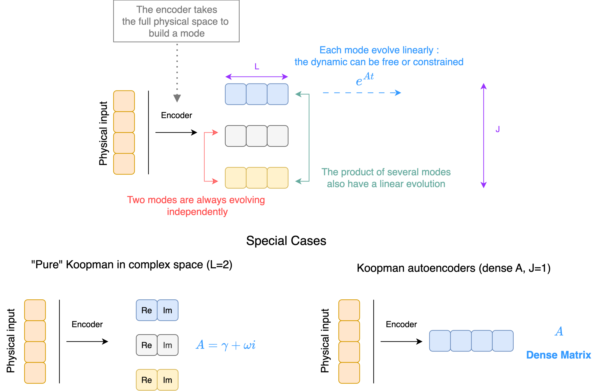

# Unrolling implementation 

Unrolling methods directly train encoder, decoder and dynamic in one time using a constrained structure :
$$
\min_{A, \mathcal E, \mathcal D} ||x_{t+\Delta_t} - \mathcal D(e^{A \Delta_t}\mathcal E({x_t}))||_2^2
$$

### <u>Reflexion on the dynamic :</u>

In "pure" koopman method, the dynamic would be independent for each eigenfunction and live in complex space, in most deep learniing implemented method $A$ is a dense matrix. 

If we wanted to restric the dynamic we have two options : 

##### 1. Restrict $A$ to be tri-diagonal + antisymmetric :

As $(a + b i)(\alpha + \beta i) = a \alpha - b \beta   + (b \alpha + a \beta)i$, if we represent our eigenfunctions as $\begin{bmatrix} a & b \end{bmatrix}^T$ with the second coordinate being the complex one and the first one being the real one, we could represent the multiplcation with $\begin{bmatrix}\alpha &-\beta \\ \beta&\alpha\end{bmatrix}$.  Stacking all the eigenfunctions together we end up having a large block-diagonal matrix we can exponentiate. 

Then we have : 
$$
\dot z = (\gamma I + \beta J)z \text{ with } J = \begin{bmatrix} 0 & -1 \\1 & 0\end{bmatrix} \to z(t) = e^{(\gamma I + \beta J)t}z_0 = e^{\gamma t} \begin{bmatrix} \cos \beta t & -\sin \beta t \\ \sin \beta t & co \beta t \end{bmatrix}
$$
Then, as shown in the complex example we can just linearly compose the complex and imaginary part of the dynamic to have a projection (taking in account the presence of the conjugate eigenfunction). 

*Pros* : we have a generic form between the dense and restricted form, it's easy to implement

*Cons* : I am not sure how optimized is the exponential of tridiagonal matrix in pytorch

```python
A = Blockdiage(alpha, beta) # Params to learn (alpha & beta : (J), (J)) -> (J, 2, 2)
psi = encoder(x) # (B, J, 2) - complex and real are separated
eA = expm(A*t, dim=-1) # (Exponential of 2x2 matrix is actually a closed form with sin/cos)

tilde_psi_next = einsum(eA, psi, 'j k l, n j l -> n j k') # (B, J, 2)
tilde_x_next = decoder(tilde_psi_next)  # (B, P)
L = ||tilde_x_next - x_next|||  # (B,)
```


##### 2. Polar representation : 

As shown in the complex notebook, we can do the evolution quickly if we represent the eigenfunctions in polar form an learn the magnitude and angle of the eigenvalues.
$$
|\psi(t)| = e^{\gamma t} r(0) \quad \angle \psi(t) =  \omega t + \angle \psi(0)
$$
And then to do the decoding (at least in linear way) you need to come back to complex notation (from the polar form) which is standard but requires to compute the cos and sin of the polar form.

Something interesting is that we can ask the encoder to directly predict the polar form which is an interesting asset to avoid the complex to polar transformation. 

**Restriction on parameter and outputs :**  For parameter $\gamma \in \R$ and $\omega \in \R$ so we are good. For the encoder output, at first sight it looks like $|\psi(t)| \in \R^+$ and $\angle \psi(t) \in [0; 2\pi]$  but in practice `polartocomplex` deals with negative absolute value and angles of any value so we don't really have constraints.

*Pros :* simple representation in the latent space, no matrix representation required

*Cons :* not a generic form with the dense representation, requires the non-linear transformation at decoding time,

```python
gamma, omega = random() # Params to learn (gamma & omega : (J), (J))
psi = encoder(x) # (B, J, 2) - complex and real are separated
tilde_psi_next = psi[..., 0]*exp(gamma*t), psi[..., 1]+omega*t # (B, J, 2) 
tilde_psi_next_complex = polartocomplex(tilde_psi_next) # (B, J, 2) 
tilde_x_next = decoder(tilde_psi_next)  # (B, P)
L = ||tilde_x_next - x_next|||  # (B,)
```


Globally we can have this view of koopman autoencoder that unite the two perspectives : 





This view is more tighted with the first code the exponential is done of $L \times L$ matrices, in the case where $L=2$ the fact to have a close form is an advantage.


Q : If you express $A = \gamma I + \omega J$ we have $e^{At} =e^{\gamma I t} + e^{\omega J t}$ do we have an easy to compute for $e^{\omega J t}$ knowing it's anti-symmetric and no diagonal. 

Q : What is the exact link between those approaches and SSL models like mamba 

Q : Globally we could generalize the idea we represent here into taking a complex dynamic, break it into a set of $J$ "simple" dynamics with fewer interaction (involving the interaction of $L$ variables) in a way you can recover the dynamic after, for me it would mean that we could think about non-linear dynamic in the different groups. What do you think ? 
