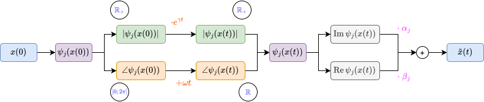

# Koopman with complex eigenfunctions 

In many systems koopman models are going to live in complex space, even if the physical variable is in real space. This impact the way we do our temporal integration and our reconstruction. 

```python
@dataclass
class ComplexPoint:
    a: float
    b: float
    c : float
    w : float
    

    def f(self, t, x):
        """x (..., 2) -> dx/dt (..., 2)"""
        x1, x2 = x[..., 0], x[..., 1]
        xp1 = self.a * x1 - self.w * x2 + self.w * self.c * x1**2

        xp2 = (
            self.w * x1
            + self.a * x2
            + self.a * self.c * x1**2
            - 2 * self.c * self.w * x1 * x2
            + 2 * self.c**2 * self.w * x1**3
        )

        return torch.stack([xp1, xp2], dim=-1)

fp = ComplexPoint(1.0, 2.0, 3.0, 4.0)

x0 = torch.tensor([1., 2.])
t_int = torch.linspace(0, 2, 100)
x_gt = odeint(fp.f, x0, t_int)
```

-> Here we show trajectory of x_gt

## Temporal evolution 

$$
\psi_j(x_t) = e^{\lambda_j t}\,\psi_j(x_0) = e^{(\gamma+\omega i)t}\, r_j(x_0)\, e^{i\varphi_j(x_0)} =  r_j(x_0)\,e^{\gamma t }\, e^{i(\varphi_j(x_0) +\omega t)}
$$

Thus we just have a scaling in magnitude and a shift in phase. Those two isolated contribution of the dynamic makes them easier to apply in polar representation than in coordinates one. 


In order to check if observed values are following a linear relationship we can : 

1. Check if their magnitude have an exponential relationship $\log(\frac{r(t)}{r(0)}) = \gamma t$

2. Check if their angle have a common shift : $\phi (t) - \phi(0) = \operatorname{mod}_{2\pi}(\omega t)$

   

```python
# True eigenfunction
def psi(x):
    x1, x2 = x[...,0], x[...,1]
    return torch.complex(x1, x2 - fp.c*x1**2)


# Test one (not an eigenfunction)
def f(x):
    x1, x2 = x[...,0], x[...,1]
    return torch.complex(x1 + x2, x1- x2)


fig, axs = plt.subplots(1, 2, figsize=(5, 4))
axs[0].set_title('Physical coordinates')
axs[0].scatter(*x_gt.T, c=t_int)
axs[0].set_xlabel(r"$x_1$")
axs[0].set_ylabel(r"$x_2$")

axs[1].set_title('Koopman coordinates')
axs[1].scatter(psi(x_gt).real, psi(x_gt).imag, c=t_int)
axs[1].set_xlabel(r"$real$")
axs[1].set_ylabel(r"$imag$")

plt.show()

# Here we need to adapt our technique to test if the projected trajectory
# Follows a linear dynamic in complex space

psi_gt = psi(x_gt)

psi_w = psi_gt.angle()
psi_w_uw = np.unwrap(psi_w)

fig.tight_layout()
plt.show()

psi_r = psi_gt.abs()

gammas = torch.log(psi_r[1:] / psi_r[0]) / t_int[1:]
omegas = (psi_w_uw[1:] - psi_w_uw[0]) / t_int[1:]
```


-> In a folded block 

```

fig, axs = plt.subplots(1, 2, figsize=(9, 3.5), sharex=True)
for ax, y, title in zip(axs, (psi_w, psi_w_uw), ('Angles', 'Unwrapped angles')):
    ax.plot(t_int, y, color='0.7', lw=0.8, zorder=1)
    ax.scatter(t_int, y, c=t_int, cmap='viridis', s=3, zorder=2)
    ax.set_title(title)
    ax.set_xlabel(r"$t$")
    ax.set_ylabel(r"$\psi$ angle [rad]")

```

For the second step you need to unwrap the angles to identify $\omega$ :


Once we have the eigenfunctions and values we can use them to project in future timestep : 

```python
# From all the estimation we consider the average as the values
gamma, omega = gammas.mean(), omegas.mean()

psi_0 = psi(x_gt[0])
psi_0_r, psi_0_w = psi_0.abs(), psi_0.angle()

tilde_psi_t_r, tilde_t_psi_w = torch.exp(gamma*t_int)*psi_0_r, psi_0_w + omega * t_int
tilde_psi_t = torch.polar(tilde_psi_t_r, tilde_t_psi_w)


fig, axs = plt.subplots(1, 2)

axs[0].scatter(psi(x_gt).real,psi(x_gt).imag)
axs[1].scatter(tilde_psi_t.real,tilde_psi_t.imag)
(psi(x_gt) - tilde_psi_t).abs() # -> color by error + colorbar
```


## Reconstruction 

As we shown in the complex notebook, koopman eigenfunctions always come with their conjugate, which allows to retrieve the real space at reconstruction time. As we want to learn $v_j = \alpha_j + \beta_j i$ which is weight given for an eigenfunction in the reconstruction we can show : 
$$
\begin{align}
\min_{\mathbf v \in \mathbb C^{J}} ||g(x) - \sum_j^J v_j \psi_j(x)|| &= ||g(x) - \sum_j^{J/2} v_j \psi_j(x) + \bar v_j \bar \psi_j(x)||\\
&= ||g(x) - \sum_j^{J/2} (\alpha_j + \beta_j i)(a_j(x) + b_j(x)i) +  (\alpha_j - \beta_j i)(a_j(x) - b_j(x)i)||\\
&= ||g(x) - 2\sum_j^{J/2} \alpha_j a_j(x) - \beta_j b_j(x)||\\
\end{align}
$$
So basically we end up doing a linear regression with the real and imaginary parts of the eigenfunction. A good news is : if we didn't represented the conjugate of $\psi_j$ well in  our choosen eigenbasis, using that method we don't need it, it will lead to the same reconstruction as if we had it. If it is present the weights will just adapt. 

Note on eigenlatice : we can use eigenlatice property to improve the representation of g(x). In the previous section we stated that each eigenfunction had it's conjugate and that we didn't needed to include it given the way we do reconstruction. Although something interesting is that they can take part in  the eigenlatice and that $\psi_j \bar \psi_j$ is an eigenfunction too ! Which increase the expressivity of the eigenspace.

```python
xs = torch.randn(10, 2)
Psi = lambda x : torch.stack([psi(x), psi(x)**2, psi(x)*psi(x).conj()], dim=-1) # (n, J)

def complex_to_component(z) :
    """
        z (n, J) -> c (n (J, 2))

    Take a complex tensor and return a real tensor with the two components stacked 
    """
    r = torch.view_as_real(z)
    r_flat = rearrange(r, 'n J c -> n (J c)')
    return r_flat

V = torch.linalg.lstsq(complex_to_component(Psi(xs)), xs).solution.T  

tilde_x_gt = complex_to_component(Psi(x_gt))@V.T 

fig, axs = plt.subplots(1, 2)

axs[0].scatter(*x_gt.T)
axs[1].scatter(*tilde_x_gt.T)
```


## Forecasting summary 

So we can summarise the forecast with the following figure : compute eigenfunction, project them in the future with polar form and recompose linearly to form the physical state : 




```python
Gammas = torch.tensor([gamma, 2*gamma, 2*gamma]) # (J)
Omegas = torch.tensor([omega, 2*omega, 0]) # (J)


psi_0 = Psi(x_gt[0])
psi_0_r, psi_0_w = psi_0.abs(), psi_0.angle() #(J), (J)

psi_r = torch.exp(Gammas[None]* t_int[:, None])*psi_0_r[None] # (T, J)
psi_w = psi_0_w[None] + Omegas*t_int[:, None] # (T, J)

psi_t = complex_to_component(torch.polar(psi_r, psi_w)) # (T, (2*J))

tilde_x_gt = psi_t@V.T

fig, axs = plt.subplots(1, 2)

axs[0].scatter(*x_gt.T, c=t_int)
axs[1].scatter(*tilde_x_gt.T, c=t_int)

```

